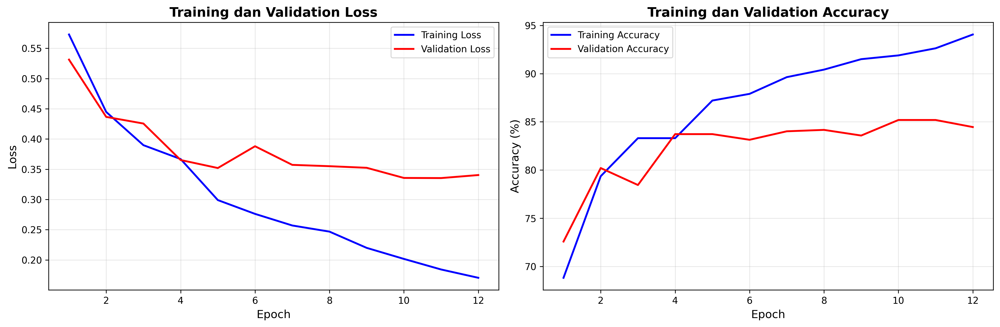
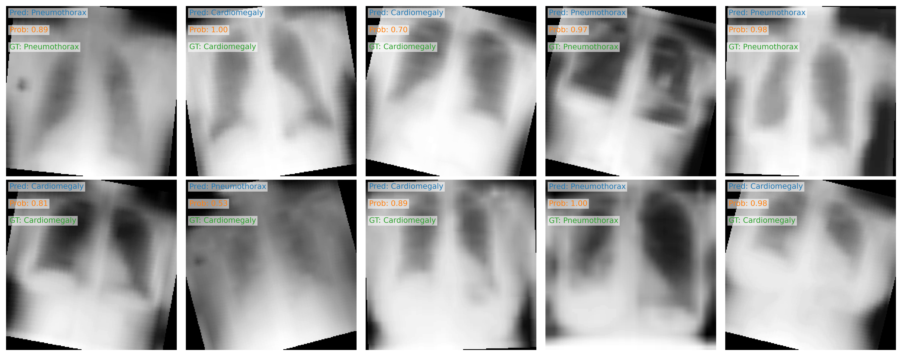

# 🧾 Laporan Percobaan Klasifikasi Citra ChestMNIST

## 1. Pendahuluan  
Penelitian ini bertujuan untuk membangun model klasifikasi biner pada dataset **ChestMNIST** menggunakan jaringan convolutional neural network (CNN) untuk membedakan dua kondisi penyakit, yaitu *Cardiomegaly* dan *Pneumothorax*.  

Model awal menggunakan arsitektur **SimpleCNN** sebagai baseline. Namun, karena performa awal yang belum optimal, dilakukan serangkaian modifikasi arsitektur, hyperparameter, dan teknik transfer learning untuk meningkatkan akurasi.

---

## 2. Dataset  
Dataset yang digunakan adalah **ChestMNIST** dari MedMNIST, berisi citra X-ray berukuran 28×28 piksel dalam format grayscale.  
Hanya dua kelas yang digunakan:
- **Label 0**: Cardiomegaly  
- **Label 1**: Pneumothorax  

Data dibagi menjadi:
- Training set  
- Validation (test) set  

Untuk menjaga kesetimbangan antar kelas, dilakukan penyaringan agar hanya citra dengan satu label penyakit yang digunakan.

---

## 3. Model dan Arsitektur  

### 3.1 Model Dasar  
Model awal adalah `SimpleCNN` yang terdiri dari dua lapisan konvolusi, dua fully connected layer, dan satu output neuron untuk klasifikasi biner.

### 3.2 Model Akhir  
Model akhir menggunakan **DenseNet-121 (pretrained)** dari `torchvision.models`, dengan modifikasi:
- Layer input diubah agar menerima **1 channel (grayscale)**  
- Layer classifier terakhir diubah menjadi **1 output neuron** untuk prediksi biner  
- Bobot awal (`pretrained=True`) diambil dari hasil pelatihan pada dataset **ImageNet**

Model ini dipilih karena arsitektur DenseNet lebih efisien dalam memanfaatkan fitur dari citra medis dan memberikan performa tinggi pada data berukuran kecil.

## 4. Preprocessing dan Augmentasi  
Transformasi citra yang digunakan pada proses pelatihan:
```python
transforms.Compose([
    transforms.Resize((224, 224)),
    transforms.RandomHorizontalFlip(),
    transforms.RandomRotation(15),
    transforms.ColorJitter(brightness=0.2, contrast=0.2),
    transforms.ToTensor(),
    transforms.Normalize(mean=[0.485], std=[0.229])
])

```
Tujuan dari augmentasi ini adalah untuk memperkaya variasi data, mencegah overfitting, dan menyesuaikan dengan distribusi data ImageNet.

## 5. Hyperparameter dan Pengaturan Pelatihan

| Parameter         | Nilai                           |
| ----------------- | ------------------------------- |
| Model             | DenseNet-121 (pretrained=True)  |
| Learning Rate     | 1 × 10⁻⁴                        |
| Optimizer         | AdamW                           |
| Scheduler         | StepLR (step_size=3, gamma=0.7) |
| Batch Size        | 32                              |
| Epochs            | 12                              |
| Loss Function     | BCEWithLogitsLoss               |
| Device            | GPU (Google Colab)              |

## 6. Hasil Pelatihan
### 6.1 Grafik Training dan Validation
Berikut hasil pelatihan selama 12 epoch:

**Training History**


**Hasil Validation**


### 6.2 Ringkasan Hasil
| Metrik              | Nilai Akhir |
| ------------------- | ----------- |
| Training Accuracy   | **94.06%**  |
| Validation Accuracy | **85.19%**  |
| Validation Loss     | **0.3404**  |

Dari grafik terlihat bahwa training loss menurun secara stabil dan validation accuracy meningkat hingga mendekati 85%, menunjukkan model berhasil belajar dengan baik tanpa overfitting yang signifikan.

## 7 Analisis

- Peningkatan utama terjadi setelah penggunaan transfer learning dengan DenseNet-121, karena pretrained weights dari ImageNet membantu model memahami pola visual dasar pada citra medis.

- Learning rate kecil (1e-4) memberikan stabilitas dalam proses konvergensi.

- Augmentasi data berhasil membantu generalisasi model terhadap data validasi.

- Belum digunakan class weighting, namun hasil sudah cukup baik sehingga langkah ini tidak menjadi keharusan untuk eksperimen berikutnya.

## 8 Kesimpulan

Model DenseNet-121 pretrained terbukti memberikan peningkatan signifikan dibandingkan model dasar SimpleCNN.
Dengan kombinasi transfer learning, augmentasi data, dan optimasi hyperparameter, model mencapai:

- Akurasi pelatihan: 94.06%

- Akurasi validasi: 85.19%

Peningkatan performa terutama dipengaruhi oleh:

1. Pemilihan model DenseNet-121 yang lebih efisien.

2. Penyesuaian learning rate ke nilai kecil (1e-4).

3. Augmentasi citra yang tepat.